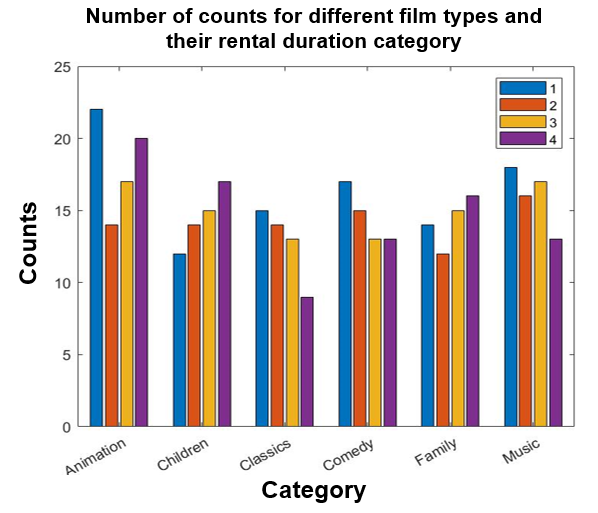
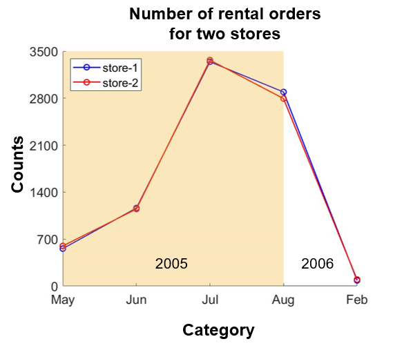
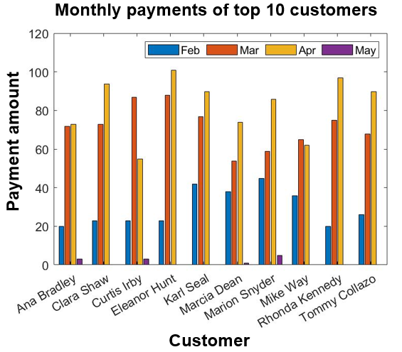

# SQL Project (Udacity)

## Introduction

The purpose of this project is to write SQL queries to investigate business questions of the **Sakila DVD Rental database**. The Sakila Database holds information about a company that rents movie DVDs. This dataset can be obtained from this page: [PostgreSQL Sample Database](https://www.postgresqltutorial.com/postgresql-sample-database/). A schema of this dataset is shown below:

  

## questions
The investigated questions are listed below. Their corresponding SQL queries can be found in *queries.txt*.

* How many family movies are rented out in each category?

  

We can see that among family movies, animation is the most popular type, which was rented out 1166 times. Music is the least popular type, which was rented out 830 times.

* For family movies, what are the counts for each combination of film type and its corresponding rental duration category?

  

This figure shows the count for each combination of the film type and its corresponding rental duration category. Notice that the rental duration is categorized by the quantile level (0%-25%, level 1; 25%-50%, level 2; 50%-75%, level 3, 75%-100%, level 4) across all film types. We can see that for a majority of the family movies, the rental durations are rather short, since the maximum counts usually happen in the first quantile. The exceptions are Children and Family type.

* How the two stores compare in their count of rental orders during every month for all the years?

  

We can see that both stores have achieved similar number of rental orders over the months.

* For top 10 customers, what were the amounts of their monthly payments during 2007?

  

We can see that, for the top 10 customers, most of their payments were made in March and April.
